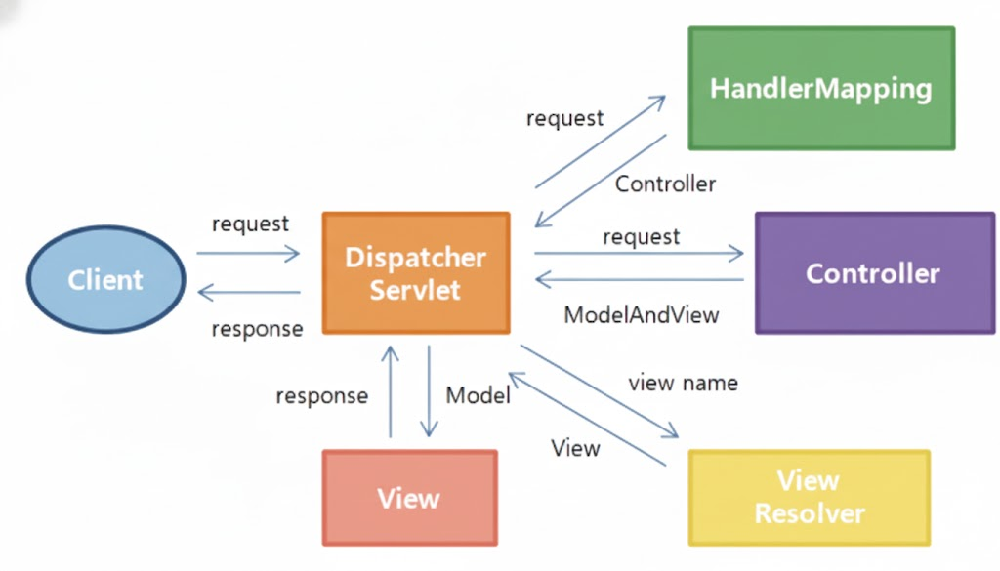

# 251114 TIL

## AOP(Aspect Oriented Programming)를 활용한 공통 관심사 분리 방법에 대해 설명해주세요.
- 횡단 관심사(Cross-Cutting Concerns)를 핵심 비즈니스 로직에서 분리하여 코드의 모듈성을 높이는 프로그래밍 패러다임

### 횡단 관심사
- 로깅, 트랜잭션, 보안, 성능 측정처럼 여러 비즈니스 로직에 공통으로 적용되는 부가 기능

### 분리방법
1. 횡단 관심사를 `Aspect` 라는 별도의 모듈로 정의
2. `Aspect` 내부에는 실제 동작할 로직인 `Advice`를 작성
3. `Pointcut`를 사용해 어떤 클래스의 어떤 메서드(Join Point)가 호출될 때 이 `Advice`를 적용할지 지정한다.

## Spring에서 트랜잭션 관리와 @Transactional 어노테이션의 역할에 대해 설명해주세요.

## @Transactional의 역할
- Spring의 선언적 트랜잭션 관리를 가능하게 하는 AOP 기반의 기능

## @Transactional 동작 원리

1. Spring @Transactional이 붙은 클래스나 메서드에 대해 프록시(Proxy) 객체를 생성
2. 메서드 호출 시, 프록시가 먼저 요청을 받아 트랜잭션을 시작
3. 비즈니스 로직을 수행
4. 메서드가 정상 종료되면 프록시가 Commit
4-1. 메서드 수행 중 RuntimeException이나 설정된 예외가 발생하면 프록시가 Rollback

```
@Transactional 어노테이션을 사용하면 Spring이 프록시 객체를 통해 메서드 실행 전에 트랜잭션을 시작하고, 메서드 정상 종료 시 Commit, RuntimeException 발생 시 Rollback을 자동으로 처리해줍니다. 이를 통해 개발자는 비즈니스 로직에만 집중할 수 있습니다.
```

## Spring MVC 아키텍처의 구성 요소와 요청 처리 과정을 설명해주세요.

### Spring MVC 요청 처리과정



1. 클라이언트 요청 → `DispatcherServlet`
- 모든 HTTP 요청을 가장 먼저 받는 진입점(Front Controller)
2. `DispatcherServlet` → `HandlerMapping`
- 요청된 URL(URI)에 매핑되는 Controller(Handler)가 있는지 찾음
3. `HandlerMapping` → `DispatcherServlet`
- 찾은 Controller 정보와 적용할 인터셉터 목록을 반환
4. `DispatcherServlet` → `HandlerAdapter`
- HandlerMapping이 찾아준 Controller를 실행할 수 있는 HandlerAdapter를 찾음
5. `HandlerAdapter` → `Controller`
- HandlerAdapter가 실제 Controller의 메서드를 실행하고, 로직을 처리
6. `Controller` → `HandlerAdapter`
- Controller는 비즈니스 로직 처리 후, 뷰 이름과 데이터(Model)가 담긴 ModelAndView 객체를 반환
  (만약 @ResponseBody가 있다면, View 과정을 생략하고 HttpMessageConverter를 통해 바로 응답 생성)
7. `HandlerAdapter` → `DispatcherServlet`
- ModelAndView 객체를 DispatcherServlet에 반환
8. `DispatcherServlet` → `ViewResolver`
- ModelAndView의 뷰 이름을 기반으로, 실제 렌더링할 View 객체를 찾아달라고 요청
9. `ViewResolver` → `DispatcherServlet`
- View 객체를 반환
10. `DispatcherServlet` → `View`
- View 객체에게 Model 데이터를 전달하며 렌더링을 요청
11. View → 클라이언트 응답
- View가 데이터를 렌더링하여 최종 HTTP 응답을 생성하고 클라이언트에게 반환

## Spring Boot의 자동 구성(Auto-Configuration) 원리에 대해 설명해주세요.
- 개발자가 설정해야 할 수많은 빈(Bean)을, 특정 조건이 맞으면 Spring Boot가 대신 등록해주는 메커니즘

## 동작원리
1. `Auto-Configuration`은 `@SpringBootApplication`에서 시작하며, 이 안에는 `@EnableAutoConfiguration`이 포함
2. `@EnableAutoConfiguration`은 Spring Boot가 제공하는 자동 구성 클래스(...AutoConfiguration) 목록을 spring.factories 또는 최신 버전의 AutoConfiguration.imports 파일에서 읽음
3. 자동 구성 클래스들은 `@Conditional... `어노테이션이 붙어있음 ex) `@ConditionalOnClass`, `@ConditionalOnMissingBean`
- `@ConditionalOnClass` : 클래스패스에 특정 라이브러리(Jar)가 있는 경우에만 설정을 활성화
     ex) DataSourceAutoConfiguration은 DataSource 클래스가 있을 때만 동작
- `@ConditionalOnMissingBean` : 개발자가 직접 해당 타입의 빈을 등록하지 않았을 경우에만 설정을 활성화. 개발자의 설정을 항상 우선시

## 예외 처리를 위한 @ControllerAdvice의 역할과 활용 방법은 무엇인가요?

### @ControllerAdvice
- AOP 기반으로 애플리케이션 전역에서 발생하는 예외를 한 곳에서 처리하기 위한 컴포넌트

### @ControllerAdvice 역할
- 중복 제거 : 여러 Controller에 흩어져 있던 `@ExceptionHandler` 메서드나 `try-catch` 블록을 하나의 클래스로 분리하여 공통 로직으로 관리
- 일관된 응답 : 애플리케이션 전체의 예외 응답 형식을 통일

### 활용법
- `@ControllerAdvice` (또는 `@RestControllerAdvice`) 어노테이션을 클래스에 사용
    @RestControllerAdvice는 @ControllerAdvice와 @ResponseBody가 합쳐진 것으로, REST API의 에러 응답에 주로 사용
- 클래스 내부에 `@ExceptionHandler(처리할_예외.class)` 어노테이션을 붙인 메서드를 정의
  HTTP 상태 코드(예: HttpStatus.BAD_REQUEST)와 에러 메시지를 담은 ResponseEntity나 전용 에러 DTO(Data Transfer Object)를 반환하도록 구현  

``` JAVA
@RestControllerAdvice /
public class GlobalExceptionHandler {

    // 커스텀 예외 처리
    @ExceptionHandler(BusinessException.class)
    protected ResponseEntity<ErrorResponse> handleBusinessException(BusinessException ex) {
        ErrorResponse response = new ErrorResponse(ex.getErrorCode(), ex.getMessage());
        return new ResponseEntity<>(response, HttpStatus.BAD_REQUEST);
    }

    // 일반 런타임 예외 처리
    @ExceptionHandler(RuntimeException.class)
    protected ResponseEntity<ErrorResponse> handleRuntimeException(RuntimeException ex) {
        ErrorResponse response = new ErrorResponse("RUNTIME_ERROR", "서버 내부 오류가 발생했습니다.");
        return new ResponseEntity<>(response, HttpStatus.INTERNAL_SERVER_ERROR);
    }
}
```


