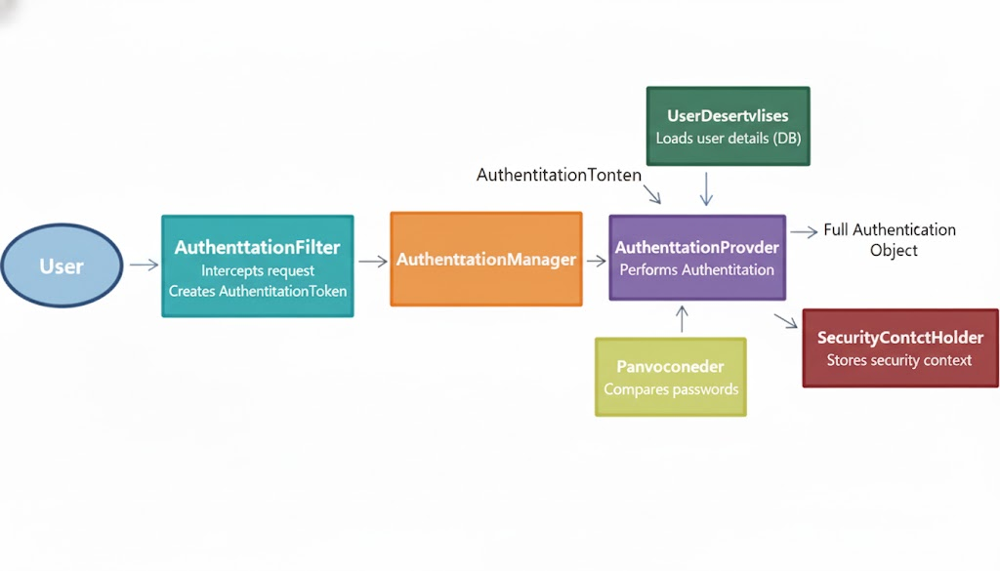
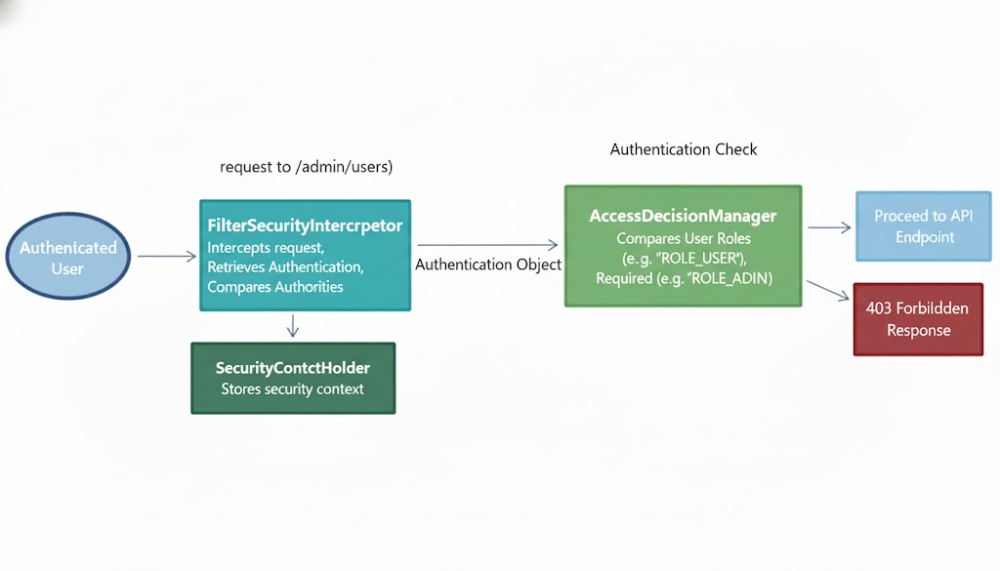

# 25114 TIL

## Spring Security의 기본 개념과 인증/인가 처리 흐름에 대해 설명해주세요.

## Spring Security
- '인증(Authentication)'과 '인가(Authorization)'를 담당하는 보안 프레임워크

### 인증과 인가
- `인증(Authentication)` : 사용자가 누구인지 증명. 사용자가 ID와 비밀번호를 제출하면, 시스템은 이 정보가 유효한지 확인.

- `인가(Authorization)` : 인증된 사용자가 특정 자원(페이지, API)에 접근할 권한이 있는지 확인

### 인증 처리



1. 사용자가 ID/PW로 로그인을 시도하면, `AuthenticationFilter`가 요청을 가로채 `AuthenticationToken`(인증용 객체)을 생성
2. Token을 `AuthenticationManager`에게 전달
3. `AuthenticationManager`가 실제 인증을 수행할 `AuthenticationProvider`를 호출
4. Provider는 `UserDetailsService`를 통해 DB에서 사용자 정보를, PasswordEncoder로 비밀번호를 비교하여 인증을 완료
4-1. 인증에 성공하면, 사용자 정보와 권한이 담긴 완전한 `Authentication` 객체를 생성하여 `SecurityContextHolder`에 저장

### 인가 처리



1. 인증된 사용자가 특정 API에 접근을 시도
2. `FilterSecurityInterceptor`가 이 요청을 가로채고, `SecurityContextHolder`에서 현재 사용자의 `Authentication` 객체를 꺼냅니다.
3. 사용자가 가진 권한(예: 'ROLE_USER')과 해당 API에 필요한 권한(예: 'ROLE_ADMIN')을 비교합니다.
4. 권한이 일치하면 접근을 허용하고, 일치하지 않으면 `403 Forbidden`을 반환


## RESTful API를 Spring에서 구현하는 방법과 모범 사례는 무엇인가요?
- `@RestController` 어노테이션을 사용하여 구현
- `@RestController`는 `@Controller`와 `@ResponseBody`가 합쳐진 것
- 모든 메서드가 뷰(View)가 아닌 JSON이나 XML 같은 데이터 본문(Body)을 반환
    - `@GetMapping`, `@PostMapping`, `@PutMapping`, `@DeleteMapping`가 HTTP Method에 맞게 요청 URL을 메소드에 매핑

### 모범 사례

- 자원(Noun) 중심의 URI 설계
    - /users, /users/{id}
    - 동사 사용 금지
- HTTP 메서드의 명확한 사용
    - `GET` : 자원 조회
    - `POST` : 자원 생성
    - `PUT`/`PATCH`: 자원 수정 (PUT: 전체, PATCH: 부분)
    - `DELETE`: 자원 삭제
- 적절한 HTTP 상태 코드 반환 
    - 성공 : 200 OK, 201 Created 
    - 클라이언트 오류 : 400 Bad Request, 401 Unauthorized, 404 Not Found
    - 서버 오류 : 500 Internal Server Error
- 일관된 예외 처리
    - `@RestControllerAdvice`를 사용하여 전역 예외 처리기를 구현하고, 일관된 에러 응답 DTO를 반환


## Spring Boot Actuator를 통한 애플리케이션 모니터링 방법은 무엇인가요?
- `Spring Boot Actuator` : 애플리케이션의 운영 및 모니터링에 필요한 기능들을 HTTP 엔드포인트(Endpoint)로 제공하는 기능

### 사용법
1. `spring-boot-starter-actuator` 의존성을 추가
2. application.yml에 주요 엔드포인트 노출 설정
```yml
management:
  endpoints:
    web:
      exposure:
        include: "health,info,metrics,loggers" # 노출할 엔드포인트 지정
  endpoint:
    health:
      show-details: always # /health에서 상세 정보(DB, 디스크) 표시
```

### 주요 모니터링 엔드포인트

- `/actuator/health` : 애플리케이션의 전반적인 상태(DB 연결, 디스크 공간 등)를 확인합니다. (상태가 UP 인지 DOWN인지)
- `/actuator/metrics` : JVM 메모리 사용량, CPU 사용률, HTTP 요청 수, 커넥션 풀 상태 등 다양한 성능 지표(Metric) 를 제공합니다.
- `/actuator/loggers` : 실행 중인 애플리케이션의 로그 레벨(INFO, DEBUG)을 실시간으로 확인하고 동적으로 변경할 수 있습니다.
- `/actuator/info` : build-info.properties나 application.yml에 정의된 애플리케이션의 빌드 버전, Git 커밋 정보 등 커스텀 정보를 노출합니다.

## Spring Cloud를 활용한 마이크로서비스 아키텍처 구현 전략에 대해 설명해주세요.
- `Spring Cloud` : 마이크로서비스(MSA) 아키텍처에서 발생하는 분산 시스템의 공통 문제를 해결하기 위한 도구 모음

### 주요 구현 전략
1. API Gateway (Spring Cloud Gateway)
- 역할 : 모든 클라이언트 요청의 단일 진입점(Entry Point)
- 기능
    - 라우팅(Routing) : 요청을 적절한 마이크로서비스로 전달
    - 보안 : 인증(Authentication) 및 인가(Authorization) 처리
    - 로드 밸런싱 : 트래픽 분산
    - 모니터링 : 요청/응답 로깅
    - 제어 : 속도 제한 (Rate Limiting)을 통해 과도한 트래픽 방지

2. Service Discovery (Netflix Eureka)
- 역할 : 동적으로 생성/소멸되는 서비스들의 위치 정보를 관리
- 기능
    - 등록(Register) : 각 서비스가 시작될 때 자신의 위치(IP, Port)를 Eureka 서버에 알림
    - 검색(Discovery) : 다른 서비스를 호출해야 할 때, Eureka에 문의하여 실제 주소를 획득

3. Configuration Server (Spring Cloud Config)
- 역할 : 모든 마이크로서비스의 application.yml 등 설정 파일을 한 곳에서 관리.
- 기능 :
    - 중앙 집중화 : Git, SVN 등 외부 저장소를 통해 설정 파일 관리.
    - 동적 반영 : 서비스 재시작 없이 설정 변경 사항을 실시간으로 반영 가능 (@RefreshScope).

4. Circuit Breaker (Resilience4j)
- 역할 : 특정 서비스의 장애가 시스템 전체로 전파되는 것을 막는 회로 차단기
- 기능 :
    - 차단(Open Circuit) : 특정 서비스(B)의 호출 실패가 임계치를 넘으면, 호출을 아예 차단하여 대기 시간을 줄임
    - 대체 응답(Fallback) : 미리 정의된 기본값을 반환하여 에러 대신 정상적인(혹은 안내) 응답 제공

5. Client-Side Load Balancer (Spring Cloud LoadBalancer)
- 역할 : 서비스 간 통신(S2S) 시 클라이언트 측에서 수행하는 부하 분산
- 기능
    - 인스턴스 선택 : Eureka에서 받아온 서비스 목록(User-Service 1, 2, 3...) 중 로드 밸런싱 알고리즘(예: Round Robin)에 따라 하나를 선택하여 호출.
    - 참고 : 과거 Netflix Ribbon이 하던 역할을 현재는 Spring Cloud LoadBalancer가 대체함.
