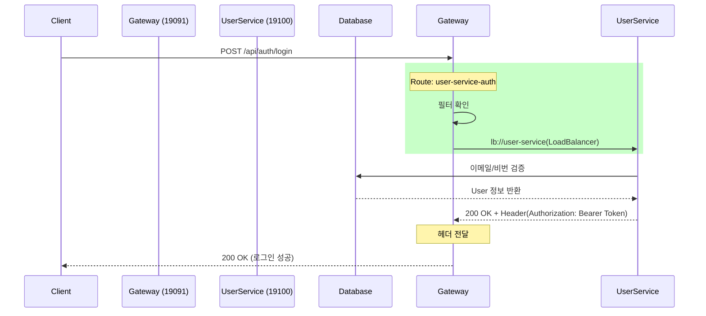

# 251213 TIL

## API Gateway 흐름도


## 오류
| 구분 | 에러 메시지 / 현상 | 원인 분석 | 해결 방법 |
| :--- | :--- | :--- | :--- |
| **Gateway** | **`404 Not Found`**<br>(Gateway에서 User-Service 호출 불가) | **YAML 문법 오류**: `routes` 리스트의 들여쓰기(Indentation)가 잘못되어 설정이 로드되지 않음 (`[]` 빈 배열) | `application.yml`의 **들여쓰기(공백 2칸/4칸) 교정** |
| **Docker** | **`Connection refused`**<br>(Comment → Eureka 연결 실패) | **네트워크 주소 오류**: 컨테이너 내부에서 `172.xx` 또는 `localhost`로 Eureka 호출 시도 실패. | `EUREKA_HOST` 환경변수를 IP가 아닌 **Docker 서비스 명(`eureka-server`)**으로 변경하여 내부 DNS 사용 |

## YAML 파싱 규칙
- YAML은 **공백(Space)**으로 계층 구조를 파악
- 탭(Tab) 문자는 금지되며, 리스트(-)의 들여쓰기가 부모 키와 맞지 않으면 해당 설정은 **무시(Null/Empty)**

## AWS 인프라 구축 순서
1. VPC & 보안 그룹(Security Group) 설정
    - EC2 : 
        - 22(SSH)
        - 80/443(Web)
2. RDS / ElasticCache 생성
3. EC2 인스턴스 생성

```bash

# 접속
ssh -i key.pem ubuntu@ip주소

# 패키지 업데이트
sudo apt-get update

# 필수 패키지 설치
sudo apt-get install -y ca-certificates curl gnupg lsb-release

# Docker GPG 키 추가
sudo mkdir -p /etc/apt/keyrings
curl -fsSL https://download.docker.com/linux/ubuntu/gpg | sudo gpg --dearmor -o /etc/apt/keyrings/docker.gpg

# Docker 저장소(Repository) 추가
echo \
  "deb [arch=$(dpkg --print-architecture) signed-by=/etc/apt/keyrings/docker.gpg] https://download.docker.com/linux/ubuntu \
  $(. /etc/os-release && echo "$VERSION_CODENAME") stable" | \
  sudo tee /etc/apt/sources.list.d/docker.list > /dev/null

# Docker 엔진 설치
sudo apt-get update
sudo apt-get install -y docker-ce docker-ce-cli containerd.io docker-compose-plugin

# sudo 없이 docker 명령어 쓰기 (권한 부여)
sudo usermod -aG docker $USER

# 로그아웃 했다가 다시 로그인
exit

# 최신 이미지 받아오기 (Docker Hub 갱신 시)
docker compose pull

mkdir deploy && cd deploy

# 설정파일 생성
vi .env
vi docker-compose.yaml

# 컨테이너 실행
docker compose up -d

# 4. 로그 확인 (실시간 모니터링)
# -f 옵션으로 계속 보기, 종료는 Ctrl+C
docker compose logs -f eureka-server
docker compose logs -f gateway
docker compose logs -f user-service

# 5. 상태 확인 (전부 Up 상태인지)
docker ps

```

### IaaS vs PaaS

| 비교 항목 | IaaS<br>`EC2` | PaaS<br>`ElastiCache`, `RDS` |
| :--- | :--- | :--- |
| **비유** | **빈 집 임대**<br>(가구, 인테리어 직접 해야 함) | **호텔 방**<br>(가구, 청소 서비스 모두 포함) |
| **제공 범위** | 가상 서버, 스토리지, 네트워크 (하드웨어) | 하드웨어 + **OS + 런타임 + 미들웨어** |
| **관리 주체** | **사용자**가 OS 업데이트, 보안 패치 등 수행 | **AWS**가 OS 패치, 백업, 복구 등을 자동 수행 |
| **유연성** | 매우 높음<br>(원하는 SW 무엇이든 설치 가능) | 낮음<br>(제공되는 기능과 버전 내에서 사용) |
| **Stop/Start** | **가능**<br>(전원 끄기 가능, 비용 절감 용이) | **불가능**<br>(삭제 후 재생성만 가능) |
| **주 사용처** | 웹 서버, 커스텀 애플리케이션 서버 | 데이터베이스, 캐시 서버, 컨테이너 오케스트레이션 |

### SSH

| 명령어 | 설명 | 예시 사용법 |
| :--- | :--- | :--- |
| **`ssh`** | 원격 서버(EC2)에 접속 | `ssh -i key.pem ubuntu@ip주소` |
| **`ls`** | 현재 위치의 파일 목록 확인 (`-al`: 자세히 보기) | `ls -al` |
| **`cd`** | 디렉토리(폴더) 이동 | `cd deploy` (deploy 폴더로 이동), `cd ..` (상위로 이동) |
| **`pwd`** | 현재 내 위치(경로) 확인 | `pwd` |
| **`cat`** | 파일 내용 출력 (읽기) | `cat docker-compose.yaml` |
| **`vi` / `nano`** | 파일 편집기 실행 | `vi application.yml` 또는 `nano application.yml` |
| **`mkdir`** | 새 폴더(디렉토리) 생성 | `mkdir deploy` |
| **`rm`** | 파일 삭제 (`-rf`: 폴더 강제 삭제) | `rm file.txt`, `rm -rf my-folder` |
| **`sudo`** | 관리자(root) 권한으로 실행 | `sudo apt update` |
| **`netstat`** | 네트워크 포트 상태 확인 (포트 충돌 확인용) | `sudo netstat -tulpn \| grep 8080` |

### docker

| 명령어 | 설명 | 예시 사용법 |
| :--- | :--- | :--- |
| **`docker ps`** | 현재 실행 중인 컨테이너 목록 확인 | `docker ps` (`-a`: 꺼진 것도 포함) |
| **`docker logs`** | 컨테이너 로그 확인 (`-f`: 실시간) | `docker logs -f gateway` |
| **`docker compose up`** | 컨테이너 실행 (`-d`: 백그라운드) | `docker compose up -d` (전체), `docker compose up -d user-service` (특정) |
| **`docker compose down`** | 실행 중인 컨테이너 중지 및 삭제 | `docker compose down` |
| **`docker compose pull`** | 최신 이미지 다운로드 (코드 수정 후 배포 시) | `docker compose pull` |
| **`docker compose restart`** | 컨테이너 재시작 | `docker compose restart gateway` |
| **`docker system prune`** | 사용하지 않는 데이터(캐시, 중지된 컨테이너) 삭제 | `docker system prune -f` |