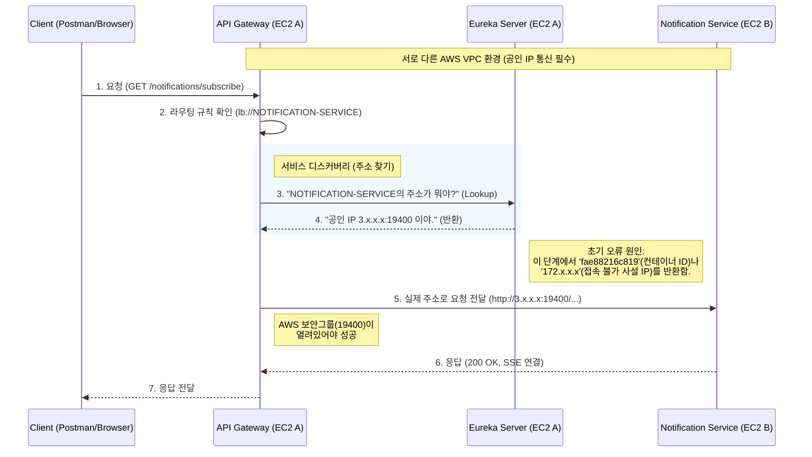

# 251218 TIL

## Eureka 서비스 이름 검색
- `API Gateway`가 `NOTIFICATION-SERVICE`라는 서비스 이름을 통해 실제 인스턴스의 주소를 찾아가는 흐름

### 트러블슈팅

| No. | 에러 | 원인 | 해결 |
| :-- | :--- | :--- | :--- |
| 1 | `java.net.UnknownHostException: Failed to resolve 'xxxxxxx'` (Gateway) | 알림 서비스가 Eureka에 IP가 아닌 **Docker 컨테이너 ID**로 등록됨 Gateway가 이를 해석(DNS Resolve)할 수 없음 | `application.yml`에 `eureka.instance.prefer-ip-address: true` 설정 추가 |
| 2 | `io.netty.channel.ConnectTimeoutException: ... /xxx.xx.x.xx:19400` (Gateway) | 도커 **네트워크 격리** 문제. Gateway(Host망)가 알림 서비스의 도커 내부망 IP(`xxx.x`)로 접근 시도 실패 | 알림 서비스 컨테이너 실행 시 **Host 네트워크 모드** 사용 (`--network host` 또는 `network_mode: "host"`). |
| 3 | `java.net.UnknownHostException: kafka` (알림 서비스) | Host 모드에서는 도커 내부 서비스명(`kafka`)을 인식 못 함 | 1. 알림 서비스가 바라보는 Kafka 주소를 `localhost:9092`로 변경 2. Kafka의 `KAFKA_ADVERTISED_LISTENERS`에 `localhost:9092` 추가 |
| 4 | `ConnectTimeoutException: ... /xxx.xx.x.xxx:19400` (Gateway) | 서로 다른 VPC 환경임에도 Eureka가 **접속 불가능한 사설 IP**를 Gateway에 알려줌 | 알림 서비스가 Eureka 등록 시 **자신의 공인 IP를 명시**하도록 설정 (`EUREKA_INSTANCE_IP_ADDRESS=${공인IP}`) |
| 5 | `ConnectTimeoutException: ... /x.xxx.xx.xxx:19400` (Gateway) | 공인 IP는 알아냈으나, Gateway(EC2 A)에서 알림 서비스(EC2 B)로의 **19400 포트 접속이 AWS 보안 그룹에 의해 차단**됨 | **알림 서비스 EC2의 보안 그룹** 인바운드 규칙에 19400 포트 허용 추가 |