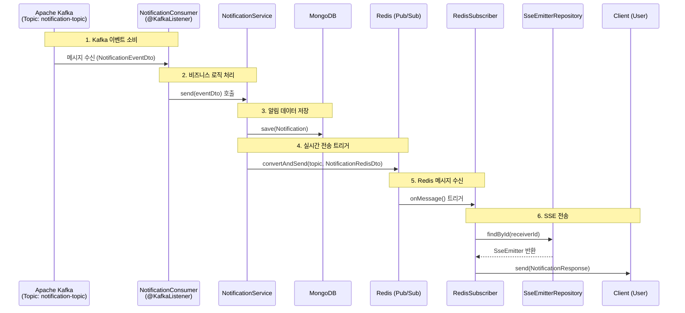

# 251222 TIL

1. Kafka 이벤트 소비 (Entry Point)
- 외부 서비스(Comment, Feed 등)에서 발생한 이벤트를 수신하는 단계

- 동작
    1. @KafkaListener 어노테이션을 통해 notification-topic을 구독
    2. Kafka로부터 JSON 메시지를 수신하여 NotificationEventDto 객체로 역직렬화
    3. 수신된 데이터를 NotificationService로 전달

2. 알림 데이터 저장 (Persistence)
- 알림 이력을 영구적으로 보관하기 위해 DB에 저장하는 단계

- 동작
    1. NotificationEventDto를 도메인 엔티티인 Notification으로 변환
    2. MongoDB에 save()를 수행하여 알림 내역을 저장

3. Redis Pub/Sub 발행 (Scaling)
- 다중 서버 환경(Scale-out)에서 클라이언트가 어느 서버에 연결되어 있든 알림을 받을 수 있도록 Redis로 이벤트를 전파
- 동작
    1. 저장된 알림 정보를 바탕으로 NotificationRedisDto를 생성
    2. RedisTemplate을 사용하여 특정 토픽(`sse:notification`)으로 메시지를 발행(publish)

4. Redis 구독 및 SSE 전송 (Real-time Push)
- Redis에서 메시지를 받아 실제 클라이언트와 연결된 SSE 객체를 찾아 데이터를 쏘는 단계
- 동작
    1. RedisSubscriber: Redis 토픽을 구독하고 있다가 메시지가 오면 onMessage가 실행
    2. SseEmitterRepository: 메시지 내의 receiverId(수신자 ID)를 키(Key)로 하여, 현재 서버 메모리에 저장된 SseEmitter 객체를 찾음
    3. Send: SseEmitter.send() 메서드를 통해 클라이언트 브라우저로 실시간 알림을 전송